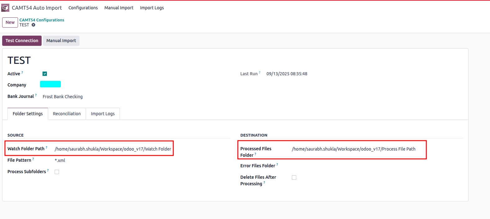
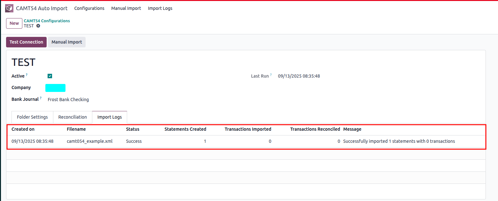
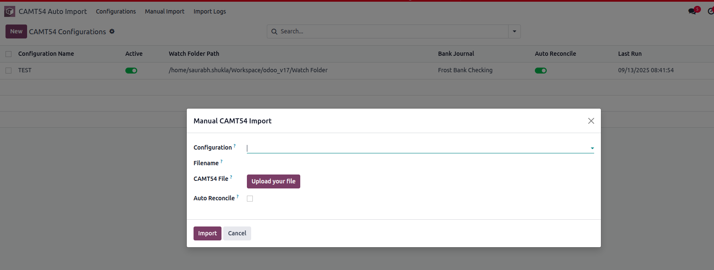
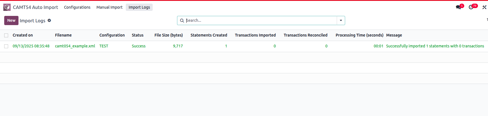

# 🏦 CAMT54 Auto Import & Reconciliation for Odoo 17

## 📋 What Does This Module Do?

This module automatically imports and reconciles **CAMT54 banking statements** in Odoo. Think of it as your personal banking assistant that:

- **Watches folders** for new CAMT54 files 24/7
- **Automatically imports** bank statements when files appear
- **Smart reconciliation** matches transactions with invoices/payments
- **Organizes files** by moving processed/error files to different folders
- **Keeps detailed logs** of everything that happens

---

## 🚀 Quick Start Guide

### Step 1: Install the Module

1. **Go to Apps** in Odoo
2. **Search for** "CAMT54 Auto Import"
3. **Click Install**

### Step 2: Set Up Your First Configuration

1. **Navigate to** `CAMT54 Auto Import > Configurations`
2. **Click "Create"**
3. **Fill in the basic information:**
   - **Name**: Give it a clear name like "Main Bank Import"
   - **Bank Journal**: Select your bank account journal
   - **Watch Folder**: Enter the folder path where CAMT54 files will appear
   
   Example: `/home/user/bank_files/incoming/`

### Step 3: Configure Folders (Optional but Recommended)

- **Processed Files Folder**: Where successful files go (e.g., `/home/user/bank_files/processed/`)
- **Error Files Folder**: Where failed files go (e.g., `/home/user/bank_files/errors/`)

### Step 4: Test Your Setup

1. **Click "Test Connection"** to verify folder access
2. **Place a CAMT54 file** in your watch folder
3. **Wait 5 minutes** (or trigger manually)
4. **Check Import Logs** to see results

---

## Features

### 🔄 Automatic File Monitoring
- Monitors specified folders for new CAMT54 files
- Configurable file patterns and subfolder monitoring
- Scheduled processing every 5 minutes (configurable)

### 🤖 Smart Reconciliation
- **Exact Amount Match**: Matches transactions with exactly the same amount
- **Reference Match**: Matches using payment references or invoice numbers  
- **Partner + Amount Match**: Matches using partner and amount combination
- **Smart Matching**: Combines all methods for optimal results

### 📁 File Management
- Automatically moves processed files to designated folders
- Separate folders for successfully processed and error files
- Option to delete files after processing
- Comprehensive error handling

### 📊 Processing Logs
- Detailed logging of all import activities
- Success/error reporting with processing time
- Transaction count and reconciliation statistics
- Retry functionality for failed imports

### ⚙️ Flexible Configuration
- Multiple configurations for different folders and journals
- Per-configuration reconciliation settings
- Company-specific configurations
- Test connection functionality

### 🔍 Manual Import Option
- Manual import wizard for one-off imports
- Override reconciliation settings per import
- Direct file upload interface

## Installation

### Prerequisites

1. **Odoo v17.0+** - This module is designed for Odoo version 17
2. **OCA Dependencies** - Install the following OCA modules:
   - `account_statement_import_camt` - Required for CAMT file parsing
3. **Python Dependencies**:
   ```bash
   pip install watchdog
   ```

### Installation Steps

1. **Clone or copy the module** to your Odoo addons directory:
   ```bash
   cp -r camt54_auto_import /path/to/odoo/custom/addons/
   ```

2. **Update Apps List** in Odoo:
   - Go to Apps menu
   - Click "Update Apps List" 
   - Search for "CAMT54 Auto Import"

3. **Install the module**:
   - Click "Install" on the CAMT54 Auto Import & Reconciliation module

## Configuration

### 1. Basic Setup

1. **Navigate to Configuration**:
   - Go to `CAMT54 Auto Import > Configurations`
   - Or `Accounting > CAMT54 Auto Import > CAMT54 Configurations`

2. **Create New Configuration**:
   - Click "Create"
   - Enter a descriptive name
   - Select the bank journal for statement import

### 2. Folder Settings

- **Watch Folder Path**: Full path to folder containing CAMT54 files
- **File Pattern**: Pattern to match files (e.g., `*.xml`, `camt54_*.xml`)
- **Process Subfolders**: Enable to monitor subfolders recursively
- **Processed Files Folder**: Where to move successfully processed files
- **Error Files Folder**: Where to move files that failed processing
- **Delete After Processing**: Option to delete files instead of moving

### 3. Reconciliation Settings

- **Auto Reconcile**: Enable automatic reconciliation
- **Reconciliation Method**: Choose from available methods:
  - Exact Amount Match
  - Reference Match  
  - Partner + Amount Match
  - Smart Matching (recommended)

### 4. Test Configuration

- Use **Test Connection** button to verify:
  - Folder exists and is accessible
  - Read/write permissions are correct
  - Destination folders can be created/accessed

## Usage

### Automatic Import

Once configured, the system automatically:

1. **Monitors** the watch folder every 5 minutes
2. **Detects** new CAMT54 files matching the pattern
3. **Validates** files are proper CAMT54 format
4. **Imports** statements into the configured journal
5. **Reconciles** transactions based on settings
6. **Moves** files to appropriate destination folders
7. **Logs** all activities for review

### Manual Import

Use the manual import wizard to:

1. **Navigate** to `CAMT54 Auto Import > Manual Import`
2. **Select** a configuration
3. **Upload** a CAMT54 file
4. **Override** reconciliation settings if needed
5. **Click Import** to process immediately

### Monitoring and Troubleshooting

1. **View Import Logs**:
   - Go to `CAMT54 Auto Import > Import Logs`
   - Review processing results, timing, and errors

2. **Retry Failed Imports**:
   - Open failed log entries
   - Click "Retry" if file is still available

3. **View Created Statements**:
   - From log entries, click "View Statements"
   - Review imported transactions and reconciliation

## Technical Details

### File Processing Flow

1. **File Detection**: Scheduled job scans watch folders
2. **Validation**: Checks if file is valid CAMT54 format
3. **Import**: Uses Odoo's standard statement import with CAMT parser
4. **Reconciliation**: Applies configured reconciliation logic
5. **Cleanup**: Moves/deletes processed files
6. **Logging**: Records results and statistics

### Reconciliation Logic

The module implements multiple reconciliation strategies:

- **Exact Match**: Finds unreconciled entries with matching amounts
- **Reference Match**: Searches invoices by reference numbers
- **Partner Match**: Combines partner and amount for matching
- **Smart Match**: Tries methods in sequence for best results

### Error Handling

- File access errors are logged and files moved to error folder
- Import failures are logged with detailed error information
- Reconciliation errors are logged but don't fail the import
- System continues processing other files if one fails

## Troubleshooting

### Common Issues

1. **Files not being processed**:
   - Check folder permissions
   - Verify file pattern matches
   - Check scheduled action is active
   - Review logs for errors

2. **Import failures**:
   - Verify CAMT54 file format
   - Check journal configuration
   - Ensure OCA dependencies installed
   - Review error details in logs

3. **Reconciliation not working**:
   - Check account types in chart of accounts
   - Verify partner information in transactions
   - Review reconciliation method settings
   - Check for duplicate transactions

### Log Analysis

Import logs provide detailed information:
- **Processing Time**: Performance metrics
- **Transaction Counts**: Import and reconciliation statistics  
- **Error Details**: Specific error messages and stack traces
- **File Information**: Size, path, and processing status

## Support and Customization

For support, customization, or additional features:
- Review the module documentation
- Check import logs for specific error messages
- Contact the module developer for custom requirements

## License

This module is licensed under LGPL-3.

## Author

Custom Development Team

---

**Note**: This module requires proper file system permissions and network access to monitored folders. Ensure your Odoo server has appropriate access rights before deployment.


### Screenshorts







